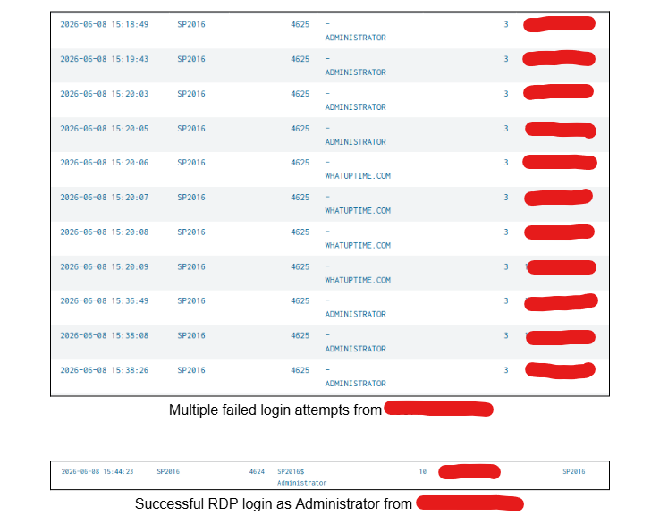
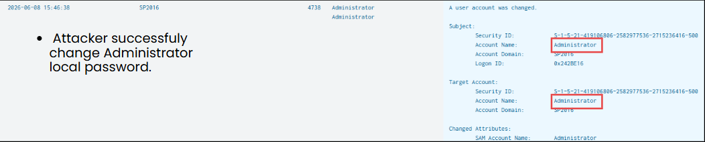
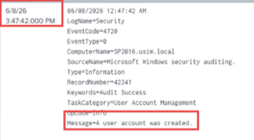
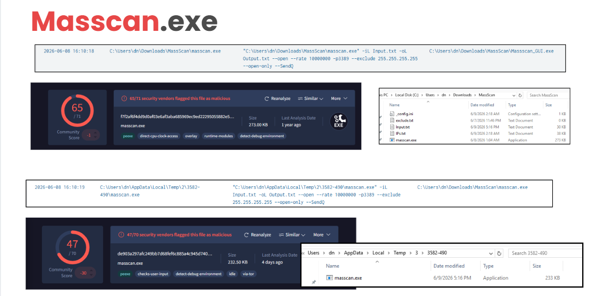
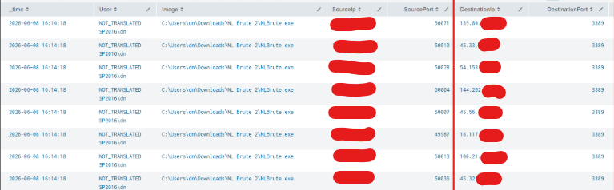

# Incident Investigation

## Incident Summary

RDP is the only interesting finding, while Sharepoint Web all are just noises, nothing else.

Repeated RDP login failures were followed by a successful remote login.
Suspicious scanning and brute-force utilities were later observed on the
SharePoint server.

## Investigation Timeline

| Time | Event | Evidence |
|---|---|---|
| 3.18 pm - 3.43 pm | Failed RDP logins | Event ID 4625 |
| 3.44 pm | Successful RDP login | Event ID 4624, Logon Type 10 |
| 3.46 pm | Admin change password | Event ID 4738 |
| 3.47 pm | new local user created | Event ID 4720 |
| 8 June 2026 | Masscan execution | Sysmon Event ID 1 |
| 8 June 2026 | NLBrute Outbound connection | Sysmon Event ID 3 |

## Authentication Analysis

The log shows repeated failed login attempts, the logs keep coming on from 3.18 pm until successful login log appear at 3.44 pm
The attacker successfully logged in as Local Sharepoint Administrator with the given password that was included in the rockyou.txt file

splunk query : host=SP2016 index=security (EventCode=4624 OR EventCode=4625)

## Sharepoint Compormised and Persistense

The attacker is able to change the Local Sharepoint Administrator password, also created a local user account name dn for persistent access.

splunk query : host=SP2016 index=security EventCode=4720
splunk query : host=SP2016 index=security EventCode=4738

## Process Analysis

| Process | Finding |
|---|---|
| `masscan.exe` | Used for network scanning |
| `Massscan_GUI.exe` | Parent interface for Masscan |
| `NLBrute.exe` | Brute-force utility |
| `winpcap-4.3.exe` | Packet-capture driver |

these are only the files that are executed 

splunk query : index=sysmon EventCode=1

also there are two different masscan by looking at their hashes different, also the file size is different.

## Network Analysis

Lookin at Sysmon event id 3, show the impact of nlbrute which is targeting all these public ips which their RDP port is exposed.

splunk query : host=SP2016 index=sysmon EventCode=3 Image="*\\NLBrute.exe"

## Conclusion

The available evidence indicates that an external source performed repeated
RDP authentication attempts against the SharePoint honeypot. A successful
Remote Desktop logon was later recorded from the same source.

Following the successful session, Sysmon detected the execution of network
scanning and brute-force utilities, including Masscan and NLBrute. The activity
was classified as unauthorized remote access followed by network reconnaissance.

