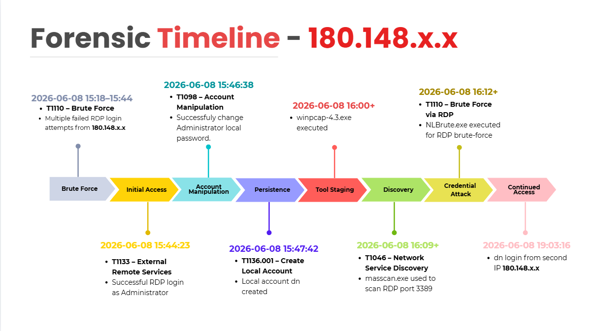

# Incident Investigation

## Incident Summary

Repeated RDP login failures were followed by a successful remote login.
Suspicious scanning and brute-force utilities were later observed on the
SharePoint server.

## Investigation Timeline

| Time | Event | Evidence |
|---|---|---|
| 10 June 2026 | Failed RDP logins | Event ID 4625 |
| 10 June 2026 | Successful RDP login | Event ID 4624, Logon Type 10 |
| 10 June 2026 | Masscan execution | Sysmon Event ID 1 |
| 10 June 2026 | Outbound connection | Sysmon Event ID 3 |

## Authentication Analysis

Explain the failed and successful RDP activity.

## Process Analysis

| Process | Finding |
|---|---|
| `masscan.exe` | Used for network scanning |
| `Massscan_GUI.exe` | Parent interface for Masscan |
| `NLBrute.exe` | Brute-force utility |
| `winpcap-4.3.exe` | Packet-capture driver |

## Network Analysis

Explain the external connections and suspicious destinations.

## Evidence Samples

Include short sanitized log examples or screenshots.

## Conclusion

Summarize what likely happened and what the evidence supports.
